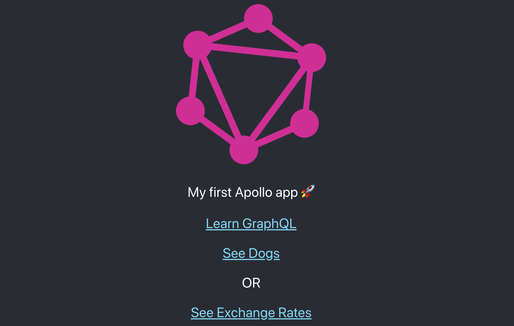

# Dogs & Exchange Rates

## Usage

```sh
# on server folder
yarn start

# on client folder
yarn start
```

## Sources

- [https://www.apollographql.com/docs/react/get-started/](https://www.apollographql.com/docs/react/get-started/)
- [https://www.apollographql.com/docs/react/data/queries/](https://www.apollographql.com/docs/react/data/queries/)

## App


